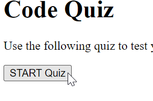
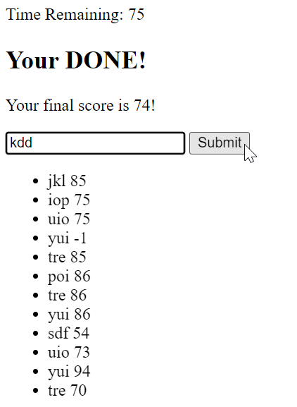
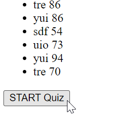

# Code-Quiz

## Description

Use this quiz to test your knowledge of JavaScript. You will only have 100 seconds to complete the quiz. If you answer a question incorrectly, ten seconds will be subtracted from your score. The time remaining when you finish the quiz is your final score. Input your initials once the quiz is over to save your intials and final score in scores list. 

## Usage
1. Click the "START Quiz" button. 

2. Read the question and select the correct answer by clicking on the appropriate button. Select your answers carefully. 10 seconds will be subtracted on each incorrect guess.

3. Enter you initials and push "Submit" to add your initials and score to the score list. 

4. Click "START Quiz again" to take the quiz again.

## URL
https://kduesler.github.io/Kyle-Code-Quiz/